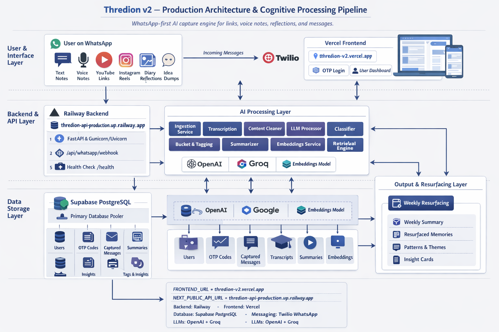
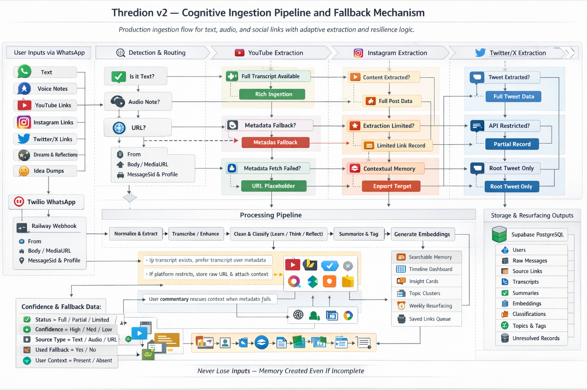

# Thredion — AI Cognitive Memory Engine

> Transform your social media saves, voice notes, reflections, and ideas into an intelligent, self-organizing knowledge system.

Thredion is a WhatsApp-first AI cognitive layer that captures links, text, voice notes, dreams, reflections, and idea dumps — then processes them into structured memory. It does not just save content. It extracts meaning, classifies intent, generates summaries, creates embeddings, stores structured memories, and resurfaces useful insights later.

---

## Live Links

| Component | Link |
|---|---|
| **Dashboard** | [thredion-v2.vercel.app](https://thredion-v2.vercel.app) |
| **API** | [thredion-api-production.up.railway.app](https://thredion-api-production.up.railway.app) |
| **Health Check** | [thredion-api-production.up.railway.app/health](https://thredion-api-production.up.railway.app/health) |
| **WhatsApp Bot** | [Chat on WhatsApp →](https://wa.me/14155238886?text=join%20deep-third) |
| **API Docs** | [thredion-api-production.up.railway.app/docs](https://thredion-api-production.up.railway.app/docs) |

---

## Try It

### WhatsApp Bot Setup

1. Click the WhatsApp link above — it opens the Twilio Sandbox number **+1 (415) 523-8886**
2. Send: `join deep-third`
3. After joining, send any of the following:
   - A YouTube link
   - An Instagram reel or post link
   - A Twitter/X post link
   - A voice note
   - A reflection or journal entry
   - A dream
   - A quick idea dump
4. Open the [Dashboard](https://thredion-v2.vercel.app) to view saved memories, resurfaced insights, and the knowledge graph

---

## Dashboard Preview


---

## System Architecture





---

## The Problem

We all save hundreds of Instagram reels, tweets, and articles — but never look at them again. They're buried, forgotten, and effectively lost knowledge.

Existing solutions just store links. They don't *understand* them.

---

## The Solution

Thredion introduces a full cognitive pipeline that turns passive saving into active knowledge building.

Users send content to a WhatsApp bot, and the system processes it through a production pipeline that:

- Ingests text, voice notes, YouTube links, Instagram links, Twitter/X links, dreams, reflections, and idea dumps
- Detects input type automatically
- Extracts metadata and source content where possible
- Transcribes audio using Faster-Whisper (CPU-optimized)
- Cleans and normalizes text
- Classifies entries into **Learn**, **Think**, or **Reflect**
- Summarizes content
- Generates vector embeddings
- Stores structured memory in PostgreSQL
- Retrieves and resurfaces relevant memories later

---

## Core Cognitive Modes

| Mode | Description |
|------|-------------|
| **Learn 🔗** | External content — YouTube videos, Instagram posts, Twitter/X posts, articles, and any URL |
| **Think 💡** | Original ideas, startup thoughts, theories, and observations |
| **Reflect 🪞** | Dreams, emotional reflections, journaling, gratitude, and inner-state notes |

---

## 5 Cognitive Capabilities

### 1. Semantic Understanding
Every saved input is processed through AI to extract meaning — not just tags, but a hierarchical topic graph.

```
Fitness → Bodyweight Training → Core Strength → Home Workout
```

### 2. Smart Resurfacing Engine
When you save new content, Thredion automatically surfaces forgotten insights that are semantically related.

> *"You saved a similar Python optimization trick 12 days ago"*

### 3. Knowledge Graph
Related ideas are automatically connected, forming a personal knowledge network you can visualize.

```
Python optimization
   ↓ connected to
FastAPI performance
   ↓ connected to
Async programming reel
```

### 4. Importance Scoring (Explainable AI)
Each memory gets a transparent score (0–100) based on:

| Factor | Weight |
|--------|--------|
| Content Richness | 0–25 |
| Novelty | 0–25 |
| Connectivity | 0–25 |
| Topic Relevance | 0–25 |

Every score comes with human-readable reasoning — full explainability.

### 5. Cognitive Dashboard
A full cognitive interface with:
- Recent Memories
- Resurfaced Insights
- Interactive Knowledge Graph (force-directed)
- Analytics & Category Distribution
- Random Inspiration button
- Inline Video/Post Players — YouTube and Instagram content plays directly in the dashboard

---

## Cognitive Pipeline

When content is received via WhatsApp or the dashboard:

```
 1. CAPTURE       → Receive input from WhatsApp or dashboard
 2. DETECT        → Identify input type (link / voice / text / reflection)
 3. NORMALIZE     → Normalize payload structure
 4. EXTRACT       → Pull title, caption, content, thumbnail from URL
 5. TRANSCRIBE    → Convert voice notes to text (Faster-Whisper)
 6. CLEAN         → Normalize and clean extracted text
 7. CLASSIFY      → AI categorization into Learn / Think / Reflect
 8. BUCKET        → Place into existing topic buckets or create new ones
 9. SUMMARIZE     → Generate concise summary
10. EMBED         → Generate 384-dim vector embedding (MiniLM-L6-v2)
11. STORE         → Persist enriched memory to PostgreSQL
12. CONNECT       → Build knowledge graph edges (cosine similarity > 0.55)
13. SCORE         → Compute explainable importance score (0–100)
14. RESURFACE     → Find and surface forgotten related memories
```

---

## WhatsApp Ingestion Flow

```
User
  → WhatsApp
  → Twilio WhatsApp Sandbox
  → Railway FastAPI webhook (/api/whatsapp/webhook)
  → Ingestion orchestrator
  → Detection engine
  → Extraction / Transcription
  → Cleaner & Normalizer
  → Classifier (Learn / Think / Reflect)
  → Summarizer
  → Embeddings
  → PostgreSQL structured memory store
  → Retrieval + Resurfacing engine
```

---

## Authentication Flow

```
User opens dashboard (Vercel)
  → Enters phone number
  → POST /auth/send-otp
  → OTP generated and stored
  → User enters OTP
  → POST /auth/verify-otp
  → OTP verified
  → JWT issued
  → Authenticated dashboard access
```

---

## Fallback Logic

Thredion preserves memory value even when platforms restrict extraction.

### YouTube Fallback
| Attempt | Action |
|---------|--------|
| Primary | Extract metadata + transcript → summarize |
| Fallback 1 | Transcript missing → summarize metadata only |
| Fallback 2 | Metadata fetch fails → store raw URL as unresolved |
| Fallback 3 | User commentary present → combine with available metadata |

### Instagram Fallback
| Attempt | Action |
|---------|--------|
| Primary | Extract caption and post metadata |
| Fallback 1 | Extraction restricted → preserve raw URL |
| Fallback 2 | Use user commentary as semantic fallback |
| Fallback 3 | Create contextual memory if only link available |

### Twitter/X Fallback
| Attempt | Action |
|---------|--------|
| Primary | Extract tweet text, author, thread context |
| Fallback 1 | Access restricted → preserve raw URL |
| Fallback 2 | Use user-typed note with link |
| Fallback 3 | Store unresolved link with user note |

### Voice Note Fallback
| Attempt | Action |
|---------|--------|
| Primary | Fetch media → transcribe → summarize → classify |
| Fallback 1 | Partial transcription failure → salvage partial transcript |
| Fallback 2 | Full failure → store audio metadata and source reference |

> No capture event is ever lost.

---

## Resilience & Fallbacks (AI Stack)

| Component | Primary | Fallback 1 | Fallback 2 |
|-----------|---------|------------|------------|
| **Embeddings** | sentence-transformers (MiniLM-L6-v2) | TF-IDF (sklearn) | Hash-based (MD5) |
| **Classification** | OpenAI GPT / Groq | Keyword matching (20 categories) | — |
| **Extraction** | Platform oEmbed API | HTML content scraping | Meta tag fallback |

---

## Memory Quality Metadata

Each stored record carries quality metadata:

| Field | Values |
|-------|--------|
| `extraction_status` | `full`, `partial`, `limited`, `unresolved` |
| `confidence_score` | `high`, `medium`, `low` |
| `source_type` | `text`, `audio`, `youtube`, `instagram`, `twitter` |
| `used_fallback` | `yes`, `no` |
| `user_context_present` | `yes`, `no` |

---

## Supported Platforms

| Platform | Input Type | Embed Player |
|----------|------------|--------------|
| **YouTube** | Videos, Shorts | ✅ Inline player |
| **Instagram** | Reels, Posts | ✅ Inline player |
| **Twitter / X** | Tweets, Threads | — |
| **Reddit** | Posts | — |
| **TikTok** | Videos | — |
| **Articles / Blogs** | Any URL | — |

---

## Edge Cases Handled

- URL with no extractable content → falls back to meta tags → then to URL itself
- No OpenAI key → keyword-based classification fallback
- sentence-transformers not installed → TF-IDF fallback → hash-based fallback
- Empty database → graceful empty states in dashboard
- Duplicate URL → detected with URL normalization, user notified instead of re-saving
- Concurrent duplicate submissions → thread-safe locking prevents race conditions
- Duplicate graph connections → prevented at database level
- Resurfacing cooldown → same memory won't resurface within 7 days
- WhatsApp message with no URL → help reply sent
- Multiple URLs in single message → processes up to 3
- Invalid URL (no http/https) → 400 error with clear message
- Image load failure → gracefully hidden in dashboard
- API timeout → retry-safe, idempotent operations
- Cascade delete → deleting memory removes connections and resurfaced entries

---

## Tech Stack

| Layer | Technology |
|-------|------------|
| **Frontend** | Next.js 14 / React / Tailwind CSS |
| **Frontend Hosting** | Vercel |
| **Backend** | Python / FastAPI |
| **Backend Hosting** | Railway (Gunicorn + Uvicorn workers) |
| **Messaging** | Twilio WhatsApp Sandbox |
| **Database** | Supabase PostgreSQL (connection pooler) |
| **Auth** | OTP + JWT |
| **LLM Providers** | OpenAI GPT, Groq |
| **Embeddings** | sentence-transformers / all-MiniLM-L6-v2 |
| **Similarity** | Cosine Similarity |
| **Transcription** | Faster-Whisper (CPU-optimized) |
| **Icons** | Lucide React |

---

## Live Deployment

| Component | Platform | URL |
|-----------|----------|-----|
| **Frontend** | Vercel | [thredion-v2.vercel.app](https://thredion-v2.vercel.app) |
| **Backend API** | Railway | [thredion-api-production.up.railway.app](https://thredion-api-production.up.railway.app) |
| **WhatsApp Bot** | Twilio Sandbox | [Chat on WhatsApp →](https://wa.me/14155238886?text=join%20deep-third) |
| **API Docs** | Swagger UI | [thredion-api-production.up.railway.app/docs](https://thredion-api-production.up.railway.app/docs) |

---

## API Endpoints

### Health
| Method | Endpoint | Description |
|--------|----------|-------------|
| `GET` | `/health` | Service health check |

### Auth
| Method | Endpoint | Description |
|--------|----------|-------------|
| `POST` | `/auth/send-otp` | Send OTP to phone number |
| `POST` | `/auth/verify-otp` | Verify OTP and issue JWT |

### Memories
| Method | Endpoint | Description |
|--------|----------|-------------|
| `GET` | `/api/memories` | List all memories (search, filter, sort) |
| `GET` | `/api/memories/{id}` | Get memory with connections |
| `POST` | `/api/process?url=...` | Process URL through cognitive pipeline |
| `DELETE` | `/api/memories/{id}` | Delete a memory |

### Knowledge & Insights
| Method | Endpoint | Description |
|--------|----------|-------------|
| `GET` | `/api/graph` | Full knowledge graph (nodes + edges) |
| `GET` | `/api/resurfaced` | Recently resurfaced insights |
| `GET` | `/api/stats` | Dashboard statistics |
| `GET` | `/api/categories` | Category distribution |
| `GET` | `/api/random` | Random memory for inspiration |

### Webhook
| Method | Endpoint | Description |
|--------|----------|-------------|
| `POST` | `/api/whatsapp/webhook` | Twilio WhatsApp webhook |

---

## Storage Model

Production storage uses Supabase PostgreSQL. Core entities include:

- `users`
- `otp_codes`
- `raw_messages`
- `source_links`
- `extracted_content`
- `transcripts`
- `summaries`
- `embeddings`
- `classifications`
- `topic_buckets`
- `resurfacing_candidates`
- `insights`
- `extraction_status` metadata
- `confidence` metadata

---

## Environment Configuration

```env
NEXT_PUBLIC_API_URL=https://thredion-api-production.up.railway.app
FRONTEND_URL=https://thredion-v2.vercel.app
DATABASE_URL=<Supabase PostgreSQL pooler connection string>
ENVIRONMENT=production
```

---

## How to Run Locally

### Prerequisites
- Python 3.10+
- Node.js 18+
- OpenAI or Groq API key (optional — keyword fallback works without it)
- Twilio account (optional — for WhatsApp bot)

### Backend

```bash
cd thredion-engine
cp .env.example .env      # Add your API keys (optional)
pip install -r requirements.txt
python main.py
```

Backend runs at `http://localhost:8000`  
API docs at `http://localhost:8000/docs`

### Frontend

```bash
cd thredion-dashboard
npm install
npm run dev
```

Dashboard runs at `http://localhost:3000`

### WhatsApp Bot Setup (Twilio Sandbox)

1. Create a free [Twilio account](https://www.twilio.com/try-twilio)
2. Go to **Messaging → Try it Out → WhatsApp Sandbox**
3. Set the webhook URL to: `https://thredion-api-production.up.railway.app/api/whatsapp/webhook` (POST)
4. Add Twilio credentials to `.env`
5. Join the sandbox: send `join deep-third` to **+1 (415) 523-8886**
6. Send any link or voice note — it processes through the full cognitive pipeline

---

## Project Structure

```
thredion/
├── assets/
│   ├── dashboard-preview.png
│   ├── architecture-diagram.png
│   └── pipeline.png
│
├── thredion-engine/              # Python backend
│   ├── main.py                   # FastAPI app entry point
│   ├── requirements.txt
│   ├── .env.example
│   ├── core/
│   │   └── config.py
│   ├── db/
│   │   ├── database.py
│   │   └── models.py
│   ├── models/
│   │   └── schemas.py
│   ├── api/
│   │   ├── routes.py
│   │   └── whatsapp.py
│   ├── services/
│   │   ├── pipeline.py
│   │   ├── extractor.py
│   │   ├── embeddings.py
│   │   ├── classifier.py
│   │   ├── knowledge_graph.py
│   │   ├── importance.py
│   │   └── resurfacing.py
│   └── tests/                    # 93 automated tests
│       ├── conftest.py
│       ├── test_api.py
│       ├── test_database.py
│       ├── test_embeddings.py
│       ├── test_pipeline.py
│       ├── test_services.py
│       └── test_demo_reliability.py
│
└── thredion-dashboard/           # Next.js frontend
    ├── src/
    │   ├── app/
    │   │   ├── layout.tsx
    │   │   ├── page.tsx
    │   │   └── globals.css
    │   ├── components/
    │   │   ├── Header.tsx
    │   │   ├── MemoryCard.tsx
    │   │   ├── StatsBar.tsx
    │   │   ├── CategoryFilter.tsx
    │   │   ├── ResurfacedPanel.tsx
    │   │   ├── KnowledgeGraphView.tsx
    │   │   ├── StatsView.tsx
    │   │   └── InspireModal.tsx
    │   └── lib/
    │       ├── api.ts
    │       ├── types.ts
    │       └── utils.ts
    ├── package.json
    ├── tailwind.config.js
    └── next.config.js
```

---

## Test Suite

**93 automated tests** covering all critical paths:

```bash
cd thredion-engine
python -m pytest tests/ -v
```

| Test File | Tests | Covers |
|-----------|-------|--------|
| `test_api.py` | 23 | All REST endpoints, CRUD, search, filters, error handling |
| `test_database.py` | 15 | ORM models, relationships, cascade delete, constraints |
| `test_embeddings.py` | 12 | 3-tier embedding fallback, cosine similarity, edge cases |
| `test_pipeline.py` | 12 | Full pipeline, duplicate detection, thread safety |
| `test_services.py` | 19 | Extractor, classifier, knowledge graph, importance, resurfacing |
| `test_demo_reliability.py` | 12 | Startup resilience, timeout handling, concurrent requests |

---

## Wow Factor Features

| Feature | Description |
|---------|-------------|
| **Inline Embeds** | YouTube and Instagram content plays directly inside the dashboard |
| **Voice-to-Mind** | Send a voice note — it gets transcribed, summarized, and stored as a memory |
| **Random Inspiration** | Rediscover a forgotten memory at the click of a button |
| **Knowledge Graph** | Interactive force-directed graph connecting related memories |
| **Smart Resurfacing** | Automatically recalls forgotten content when you save something related |
| **Explainable AI** | Every importance score comes with transparent reasoning |
| **6 Platforms** | Instagram, Twitter/X, YouTube, Reddit, TikTok, and any article URL |
| **3-Tier Fallback** | Embeddings and classification never crash — always a fallback path |
| **Multi-Input Bot** | Links, ideas, reflections, dreams, voice notes — all in one WhatsApp chat |

---

## Future Vision

Thredion is evolving toward a **cognitive operating system** for human memory augmentation:

- Scheduled weekly Memory Digest emails
- Browser extension for instant saves
- Collaborative knowledge graphs
- Advanced RAG — Q&A over your entire saved knowledge base
- Deeper personal knowledge graph navigation
- Richer multimodal capture

---

## Built For

**Hack The Thread** — Turning Instagram Saves into a Knowledge Base

---

## License

MIT